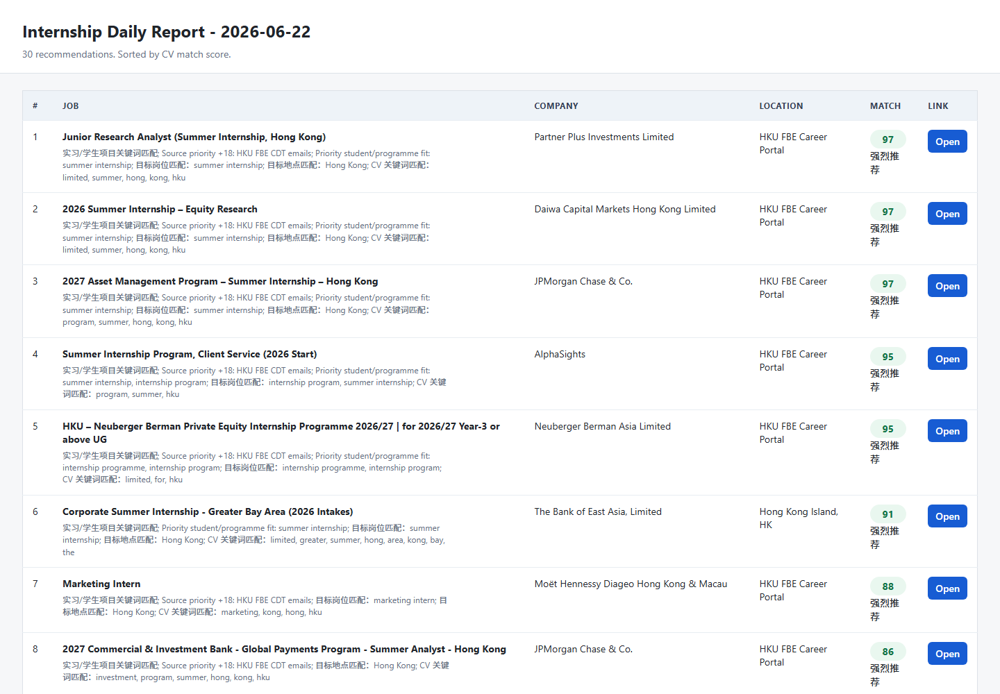
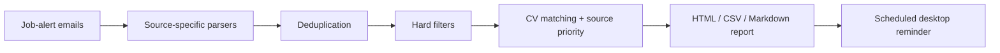

# AI Internship Radar

> Turn noisy job-alert emails into a focused, CV-ranked internship shortlist.



## The friction I noticed

Internship hunting looked simple until I tried to do it every day:

- Job alerts arrived across school newsletters, LinkedIn, and job boards.
- The same role appeared more than once.
- "Recommended" roles often required several years of experience.
- Insurance-sales roles were frequently disguised as internships or wealth-management opportunities.
- The useful information was buried in email: title, company, location, deadline, and application link.
- A manual review took time and still made it easy to miss a strong opening.

I used AI coding agents to turn that recurring frustration into a working personal tool.

## What it does

AI Internship Radar reads configured job-alert emails, extracts individual roles, filters obvious mismatches, scores each role against a CV, and generates a clean daily report.



### Current source priority

1. University career emails
2. LinkedIn job emails
3. Other job boards

### Filters that reflect real student constraints

- Prioritises Year 3 / Year 4, penultimate-year, undergraduate, summer-internship, and internship-programme roles.
- Downranks experienced-hire roles and jobs requesting 2+ years of experience.
- Blocks insurance-sales and financial-adviser keywords.
- Removes duplicates across repeated alerts.

## Why this is an AI-assisted build

The interesting part was not asking an agent to "make an app" once. It was using the agent as an implementation partner while I kept diagnosing the real workflow:

| Observation | Product change |
| --- | --- |
| The first run returned zero jobs | Traced authentication, environment variables, and source status |
| Entire emails were treated as one job | Added source-specific link extraction |
| Job-board emails polluted company and location fields | Parsed each listing independently |
| Strong scores went to roles requiring 3+ years | Added student-fit signals and experience penalties |
| Insurance sales appeared as wealth-management internships | Added hard exclusion rules |
| Reports accumulated and scheduled runs were unreliable | Added retention, logs, and catch-up scheduling |

This is what vibe coding means to me: I provide the judgment, constraints, and feedback loop; AI helps me turn those decisions into software quickly.

## Output

Each run can generate:

- `daily_report_YYYY-MM-DD.html` for a browser-native table
- `daily_report_YYYY-MM-DD.csv` for sorting and analysis
- `daily_report_YYYY-MM-DD.md` for readable text
- `apply_reminders_YYYY-MM-DD.ics` for calendar reminders
- `source_status_YYYY-MM-DD.txt` for diagnostics

Only the latest three report dates are retained by default.

## Quick start

Requirements: Python 3.10+ and an email account with IMAP access.

```powershell
Copy-Item config.example.json config.json
Copy-Item cv.example.txt cv.txt
$env:INTERNSHIP_EMAIL_PASSWORD = "your-app-password"
python monitor.py --config config.json --include-seen
```

Then open the generated HTML file in `reports/`.

## Configure your own sources

`config.example.json` contains safe placeholders for:

- university career newsletters forwarded to Gmail
- LinkedIn company/job-update emails
- SEEK-style job alerts

Source-specific priorities and blocked keywords are configurable.

## Privacy by design

This public repository intentionally excludes:

- real email addresses and app passwords
- the private CV used for matching
- downloaded emails and HTML pages
- generated reports and application history
- local paths, caches, and task-scheduler files

Use an app password or OAuth-compatible credential stored in an environment variable. Never commit credentials to Git.

## Project structure

```text
monitor.py             Core collection, parsing, filtering, scoring, and reporting
config.example.json    Sanitised configuration template
cv.example.txt         Minimal CV input example
assets/                Public screenshots
```

## Roadmap

- OAuth support for Gmail and Outlook
- Better job-detail enrichment before scoring
- Explainable weighting controls in the HTML report
- Application tracking and interview-stage analytics

## License

MIT
